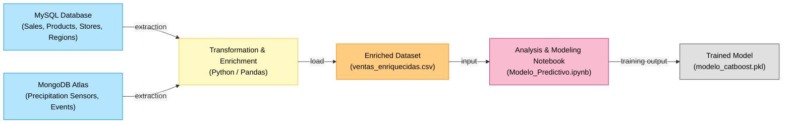

# Sales Predictive Model  
### BY JULIANA ALEJANDRA ARENAS LOBO  

# Objective
This project is a personal project involving data analysis and artificial intelligence aimed at developing a predictive model for the FastFoods chain in Bogotá, to estimate sales volume based on variables such as rainfall in mm, taken from sensors and processed according to the time closest to the purchase event and the location closest to the store where the purchase was made.

The objective is to develop a model that predicts daily sales per store, integrating geographic, store, and environmental information.
The actual influence of rainfall on sales dynamics is also evaluated, comparing a simple model against a more complete one in terms of dependent variables.
It is strongly recommended to review the .ipynb to see in more detail what was done, how it was done, and why it was done, as well as the visualization and interpretation of results.

## What was done?  

1. **Data extraction**  
   a. Two sources were connected:  
   * MySQL database: to obtain sales, products, stores, and regions.  
   * MongoDB Atlas: to locate sensors and precipitation events.  

   b. Both sources were integrated into a final dataset: `ventas_enriquecidas.csv`. Details of processing, cleaning, and transformation can be found in the `.ipynb`.

2. **Transformation and enrichment**  
   * Created a `store_location` column as a tuple (lat, lon).  
   * Assigned the nearest sensor to each store using geolocation.  
   * Interpolated the closest precipitation in time for each sale.  
   * Added a `season` column and variables such as day, month, year, hour, schedule.  

3. **Geographic grouping (DBSCAN)**  
   * DBSCAN was used to cluster stores into similar regions based on their geographic location, without requiring a fixed number of clusters. The resulting `region_cluster` was added as a key predictor variable.  

4. **Modeling**  
   Two models were trained with CatBoostRegressor:  
   * **Model 1 (complete):** employees, average precipitation value, region_cluster.  
   * **Model 2 (only rain):** only average precipitation value.

## Generated files  

| File                          | Description                                                                 |
|-------------------------------|------------------------------------------------------------------------------|
| `Modelo_Predictivo.ipynb`     | Main notebook with the full technical process, analysis, and visualizations. |
| `ventas_enriquecidas.csv`     | Final dataset with all transformed and enriched variables.                   |
| `modelo_catboost.pkl`         | Final trained Model 1                                                        |  

## Results  

The `.ipynb` file includes more detailed analysis and plots; below are the highlights that led to the final model.  

### Correlation analysis

* Employees and store scale show strong positive correlation with sales:  
  * employees vs daily_total_sales = 0.64  
  * scale vs daily_total_sales = 0.65  
* Average precipitation vs sales = 0.12 (weak correlation).  
* Geographic variables (latitude, longitude) have varied correlations (possibly linked to high/low sales zones).  
* No clear evidence that season alone has strong influence.  
* Sale type is not directly correlated with daily_total_sales, likely because both are represented in separate subsets.  

* The correlation can be seen in the bar chart of Sales Volume by Store Size, as the larger the store, the more customers it will attract and the more sales it will have.
  

* It is evident that the more employees a store has, the more sales it will generate, although it can be seen that some medium-sized stores have higher sales than large stores.
* Precipitation has a very low correlation with sales, both overall and by channel.
* Internal store variables such as employees and scale have a much more significant correlation.
* Based on all of the above analysis, the decision is made to build two predictive models: one with precipitation alone (to evaluate its isolated effect) and one with precipitation + employees (to improve the predictive power of the model).

Model 1, the complete one (employees, rainfall, location):

* R2 score: 0.76
* MSE: 78.26
* The graphs showed a strong alignment between actual and predicted sales.
* There are symmetrically distributed errors, centered on zero.
* There are some outliers that deviate from 20 or -30, but they are few.

Model 2, rain only:
* R2 score: 0.08
* MSE: 295.06
* Poor predictions, low sensitivity to actual variability.
* The residuals were more scattered and biased, confirming that precipitation alone does not explain sales.

# Why use R2 score and MSE (Mean Squared Error) as metrics?

* Because R2 score explains the proportion of variability in the dependent variable (total_daily_sales) that is explained by the independent variables (which may be only rainfall, or those handled in model 1), and MSE indicates the size of the errors in absolute terms, which is useful for getting an idea of how much the model's predictions deviate from the actual values.

# Why DBSCAN for the first model?

Because we wanted to incorporate the geographical location of stores as a predictor variable. Since location is represented by coordinates (latitude, longitude), it was necessary to transform this information into a numerically useful form for the model. DBSCAN is a spatial clustering algorithm that groups points that are close to each other according to a Euclidean distance and a minimum point density. Unlike KMEANS, it ignores outliers (geographic noise) and automatically identifies dense areas of stores, as well as the number of clusters without specifying it.

# Why was CatBoost chosen over other models such as XGBoost, LightGBM, or Random Forest?

Because compared to XGBoost and Random Forest, CatBoost was more stable in terms of training time and results, as XGBoost had achieved an R2 score of 73% and an MSE of 84 in tests, and Random Forest had obtained the worst results, with an R2 score of 64% and an MSE of 115.

# ETL Diagram

# Conclusions
* The precipitation variable has very low predictive power on its own. Model 1 (DBSCAN + variables other than precipitation) is chosen.
* Sales are much more correlated with internal variables such as: Number of employees. Store size. Geographic location, grouped with DBSCAN.
* It is possible to incorporate multiple heterogeneous data sources (SQL databases, sensors, events) into a single pipeline to generate a dataframe with which to train a predictive model.

# ADDITIONAL NOTE
When you want to install a package in colab, you must use ‘!pip install’ + the name of the package, for example: !pip install catboost
The original language of this project is Spanish, so the .ipynb will have annotations in this language.
